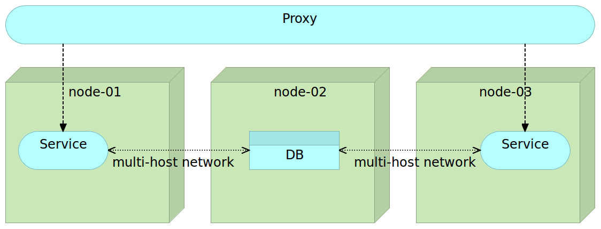

Deploying Containers with Docker Swarm and Docker Networking
============================================================

The purpose of this article is to explore new Docker networking features applied to a Docker Swarm cluster. For practice purposes we'll be deploying containers to a Swarm cluster created locally with Vagrant and running Consul as a service registry and Registrator as a tool that will monitor Docker daemons and register/deregister containers we run/stop. When combined, Consul and Registrator will act as service discovery within our cluster. I won't go into details how Docker Swarm or service discovery works. You can find more information about those subject in the following articles.

* [Service Discovery: Zookeeper vs etcd vs Consul](http://technologyconversations.com/2015/09/08/service-discovery-zookeeper-vs-etcd-vs-consul/)
* [Docker Clustering Tools Compared: Kubernetes vs Docker Swarm](http://technologyconversations.com/2015/11/04/docker-clustering-tools-compared-kubernetes-vs-docker-swarm/)
* [Scaling To Infinity with Docker Swarm, Docker Compose and Consul](http://technologyconversations.com/2015/07/02/scaling-to-infinity-with-docker-swarm-docker-compose-and-consul-part-14-a-taste-of-what-is-to-come/)

We'll skip straight into Docker networking features used within a Swarm cluster.

Setting Up the Cluster
----------------------

First things first. Let's set up three VMs that we'll use as a practice ground. The *swarm-master* node will act as master while the other two VMs will represent our cluster consisting of two nodes. All three VMs will be running Ubuntu and be created with [VirtualBox](https://www.virtualbox.org/) and [Vagrant](https://www.vagrantup.com/). Please make sure that both are installed. You'll also need [Git](https://git-scm.com/) to clone the code that will be used throughout this article. If you are a Windows user, please follow the instructions described in [Running Linux VMs on Windows](http://technologyconversations.com/2015/11/24/running-linux-vms-on-windows/) before you diving into those described below.

Let's start by creating the VMs that will simulate our Swarm cluster.

```bash
git clone https://github.com/vfarcic/docker-swarm-networking.git

cd docker-swarm-networking

vagrant up swarm-master swarm-node-1 swarm-node-2

vagrant ssh swarm-master
```

Now that the VMs are created and we are inside the *swarm-master*, let's provision them with Docker, Docker Compose, Consul, Registrator and Swarm. We'll do that through [Ansible](http://www.ansible.com/). If you are new to Ansible, you'll find plenty of examples in this blog.

```bash
ansible-playbook /vagrant/ansible/swarm.yml \
    -i /vagrant/ansible/hosts/prod
```

The *swarm.yml* playbook made sure that Docker is running and configured to support Swarm. It also provisioned servers with Docker Compose, Consul, Swarm and Registrator. We

```bash
export DOCKER_HOST=tcp://localhost:2375

docker info

curl localhost:8500/v1/catalog/nodes | jq '.'
```

The *DOCKER_HOST* variable tells Docker to send commands to the *Swarm master* running on port *2375*. That was followed with `docker info` that showed that there are two nodes in the Swarm cluster. Finally, the last command requested the list of all nodes registered in Consul and got the list of all three VMs (one Swarm master and two Swarm nodes) as the response.

At this moment we have the Swarm cluster up and running and can start playing with Docker networking. However, before we continue with practical examples, let us quickly go through the idea behinf Docker networking.

TODO: Continue

### Deploying with Docker Swarm and Docker Networking

Not long ago Docker introduced a new release 1.9. It is, without a doubt, the most important release since version 1.0. It gave us two long awaited features; multi-host networking and persistent volumes. Networking makes linking deprecated and is the feature we need in order to connect containers across multiple hosts. There is no more need for proxy services to link multiple containers that constitute a service. That is not to say that proxy is not useful but that we should use proxy as a public interface towards our services and networking for connecting containers that form a logical group. The new Docker networking and proxy services have different advantages and should be used for different use cases. Proxy services provide load balancing and can control the access to our services. Docker networking is a convenient way to connect separate containers that form a single service and reside on the same network. A common use case for Docker networking would be a service that requires a connection to a database. We can connect those two through networking. Further more, the service itself might need to be scaled and have multiple instances running. A proxy service with load balancer should fulfil that requirement. Finally, other services might need to access this service. Since we want to take advantage of load balancing, that access should also be through a proxy.



This figure represent one common use case. We have a scaled service with two instances running on nodes 1 and 3. All communication to those services is performed through a proxy service that takes care of load balancing and security. Any service (be it external or internal) that wants to access our service needs to go through the proxy. Internally, the service uses the database. The communication between the service and the database is internal and performed through the multi-host network. This setting allows us to easily scale within the cluster while keeping all communication between containers that compose a single service internal. In other words, all communication between containers that compose a service is done through networking while the communication between distinct services is performed through the proxy.

There are different ways to create a multi-host network. We can set up the network manually.

```bash
docker network create my-network

docker network ls
```

The output of the `network ls` command is as follows.

```
NETWORK ID          NAME                           DRIVER
f8a50a3c9c13        swarm-node-1/host              host
8ae6cefc3957        swarm-node-2/host              host
5f68a88668f6        swarm-node-2/bridge            bridge
397107ba0daf        swarm-node-2/none              null
b655577f0030        swarm-node-1/bridge            bridge
efb02b0fa9b9        swarm-node-1/docker_gwbridge   bridge
eb5ff0f0136a        swarm-node-1/none              null
71b80ae02620        my-network                     overlay
ac4261d5e27a        swarm-node-2/docker_gwbridge   bridge
```

You'll see that one of the networks is *my-network* we created earlier. It spans the whole Swarm cluster. We can use this network with the *--net* argument.

```bash
docker run -d --name books-ms-db \
    --net my-network \
    mongo

docker run -d --name books-ms \
    --net my-network \
    -e DB_HOST=books-ms-db \
    -p 8080 \
    vfarcic/books-ms
```

Before we continue, let's confirm that Swarm distributed the containers within the cluster.

```bash
docker ps --filter name=books --format "table {{.Names}}"
```

The output, in my case, is as follows.

```
NAMES
swarm-node-2/books-ms
swarm-node-1/books-ms-db
```

You can see that each container was deployed to a different node. That's the main purpose of Docker Swarm; to distribute containers across the cluster. The question is how can those containers communicate with each other if they reside on separate nodes?

We started two containers that compose a single service; *books-ms* is the API that communicates with *books-ms-db* that acts as a database. Since both containers had the *--net my-network* argument, they both belong to the *my-network* network. As a result, Docker updated hosts file providing each container with an alias that can be used for internal communication.

Let's enter the books-ms container and take a look at the hosts file.

```bash
docker exec -it books-ms cat /etc/hosts
```

The output of the *exec* command is as follows.

```
10.0.0.2	3166318f0f9c
127.0.0.1	localhost
::1	localhost ip6-localhost ip6-loopback
fe00::0	ip6-localnet
ff00::0	ip6-mcastprefix
ff02::1	ip6-allnodes
ff02::2	ip6-allrouters
10.0.0.2	books-ms-db
10.0.0.2	books-ms-db.my-network
```
The interesting part of the *hosts* file are last two entries. Docker detected that the *books-ms-db* container uses the same network and updated the *hosts* file by adding *books-ms-db* (name of the other container) and *books-ms-db.my-network* (name of the other container plus the name of the network) aliases. If some kind of a convention is used, it is trivial to code our services in a way that they use aliases like that one to communicate with resources located in a separate container (in this case with the database).

We also passed an environment variable *DB_HOST* to the *book-ms*. That indicates to our service which host to use to connect to the database. We can see this by outputting environments of the container.

```bash
docker exec -it books-ms env
```

The output of the command is as follows.

```
PATH=/usr/local/sbin:/usr/local/bin:/usr/sbin:/usr/bin:/sbin:/bin
HOSTNAME=eb3443a66355
DB_HOST=books-ms-db
DB_DBNAME=books
DB_COLLECTION=books
HOME=/root
```

As you can see, one of the environment variables is *DB_HOST* with the value *books-ms-db*.

What we have right now is Docker networking that created hosts alias *books-ms-db* pointing to the IP of the network Docker created. We also have an environment variable *DB_HOST* with value *books-ms-db*. The code of the service uses that variable to connect to the database. You might use a different logic. The important part is that Docker updated the hosts file with aliases that can be used to access any other container that belongs to the same *overlay* network.

There is an even better way to create the networking than running the *create network* command. Before we try it out, let's stop those two containers and remove the network.

```bash
docker rm -f books-ms books-ms-db

docker network rm my-network
```

This time we'll run containers through Docker Compose. While we could use the *net* argument inside *docker-compose.yml* and thus doing exactly the same process as we did earlier, it is a better option to use the new Docker Compose argument *--x-networking*.

```bash
cd /vagrant/booksms

docker-compose --x-networking up -d db app
```

The output of the command we just run is following.

```
Creating network "booksms" with driver "None"
Creating booksms_app_1
Creating books-ms-db
```

Before creating the services *app* and *db*, Docker created a new network called *booksms*. The name of the network is the same as the name of the project (defaults to the directory name).

We can confirm that the network was created by running the `docker network ls` command.

```bash
docker network ls
```

The output is as follows.

```
NETWORK ID          NAME                           DRIVER
6e5f816d4800        swarm-node-1/host              host
aa1ccdaefd70        swarm-node-2/docker_gwbridge   bridge
cd8b1c3d9be5        swarm-node-2/none              null
ebcc040e5c0c        swarm-node-1/bridge            bridge
6768bad8b390        swarm-node-1/docker_gwbridge   bridge
8ebdbd3de5a6        swarm-node-1/none              null
58a585d09bbc        booksms                        overlay
de4925ea50d1        swarm-node-2/bridge            bridge
2b003ff6e5da        swarm-node-2/host              host
```

As you can see, the *overlay* network *booksms* has been created.

We can also double check that the *hosts* file inside containers has been updated.

```bash
docker exec -it booksms_app_1 cat /etc/hosts
```

The output is as follows.

```
10.0.0.2	3166318f0f9c
127.0.0.1	localhost
::1	localhost ip6-localhost ip6-loopback
fe00::0	ip6-localnet
ff00::0	ip6-mcastprefix
ff02::1	ip6-allnodes
ff02::2	ip6-allrouters
10.0.0.3	books-ms-db
10.0.0.3	books-ms-db.my-network
```

Finally, let's see how did Swarm distribute our containers.

```bash
docker ps --filter name=books --format "table {{.Names}}"
```

The output is as follows.

```
NAMES
swarm-node-2/books-ms-db
swarm-node-1/booksms_app_1
```

Swarm deployed the *app* container to the *swarm-node-1* and the *db* container to the *swarm-node-2*.

Finally, let's test whether the *book-ms* service is working properly. We do not know to which server Swarm deployed the container nor which port is exposed. Since we do not (yet) have a proxy, we'll retrieve the IP and the port of the service from Consul, send a PUT request to store some data to the database residing in a different container and, finally, send a GET request to check whether we can retrieve the record. Since we do not have a proxy service that would make sure that requests are redirected to the correct server and port, we'll have to retrieve the address and the port from Consul. For more information how to set up a proxy service, please consult the [Scaling To Infinity with Docker Swarm, Docker Compose and Consul](http://technologyconversations.com/2015/07/02/scaling-to-infinity-with-docker-swarm-docker-compose-and-consul-part-14-a-taste-of-what-is-to-come/) article.

```bash
ADDRESS=`curl \
    localhost:8500/v1/catalog/service/books-ms \
    | jq -r '.[0].ServiceAddress + ":" + (.[0].ServicePort | tostring)'`

curl -H 'Content-Type: application/json' -X PUT -d \
  '{"_id": 2,
  "title": "My Second Book",
  "author": "John Doe",
  "description": "A bit better book"}' \
  $ADDRESS/api/v1/books | jq '.'

curl $ADDRESS/api/v1/books | jq '.'
```

The last command output is as follows.

```
[
  {
    "author": "John Doe",
    "title": "My Second Book",
    "_id": 2
  }
]
```

If the service could not communicate with the database located in a different node, we would not be able to put nor to get data. Networking between containers deployed to separate servers worked! All we have to do is use an additional argument with Docker Compose (*--x-networking*) and make sure that the service code utilizes information from the hosts file.

Another advantage of Docker networking is that if one container stops working, we can redeploy it (potentially to separate server) and, assuming that the services using it can handle the temporary connection loss, continue using it as if nothing happened.

Docker networking was a long awaited feature that allows us to distribute containers without the fear whether they will be able to communicate with each other. We can, finally, distribute containers without the restrictions that links introduces (linked container had to run on the same server). There is no more need for workarounds that some of us had to employ in the past. It is an exiting feature that will surely allow Docker Swarm to move to the next level.

Try it out for your self. Investigate the other options Docker networking introduced. Once you're done, you will probably want to destroy the VMs we created so that resources are freed for other tasks.

```bash
exit

vagrant destroy -f
```